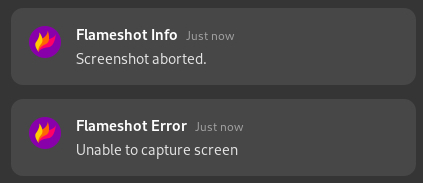
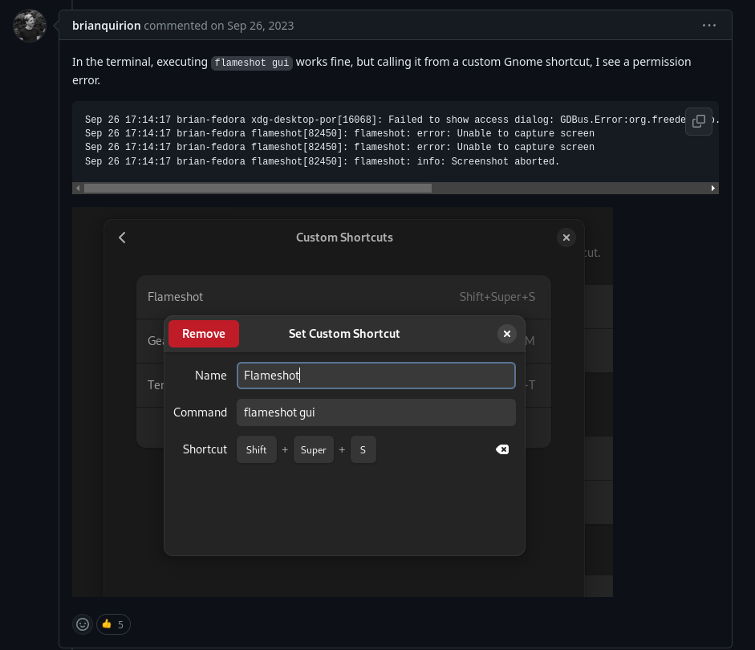

## Lightshot alternative?

Lately, I've been using Fedora (learning devops/syadmin) but one thing bothered me: the screenshot feature. You see, I come from a Windows background, so I was very familiar with Lightshot, which is pretty handy, especially if you want to draw things when taking the screenshot.

But on Linux, there is no Lightshot. You have to press `PrintScreen`, adjust the area to take the screenshot by dragging the borders of the rectangle, and then click on a button to save the screenshot. You can't save directly to a file. You can't draw before saving the screenshot. Don't get me wrong, it works, but I just find it very lacking.

So, I went looking for alternatives to Lightshot, and then I found Flameshot. It had everything I needed, so it was a no brainer choice to install it.

But...

## Unable to capture screen

I created a custom shortcut to run `flameshot gui` when pressing the `PrintScreen` key. That was everything I needed, I thought. Well, yeah, the thing is: it did not work. I kept getting the same error message: _Unable to capture screen_.



As I came from a Windows background, I'm still learning the hopes of Linux, so troubleshooting this would be a little tricky.

## Breaking down the problem

The first thing I tried was searching for _flameshot error unable to capture screen_, but after spending around 10 minutes with this approach, I knew I was going nowhere. The error was too vague; I needed to be more specific.

I tried running Flameshot by opening its shortcut on the software list. Nothing. Not even an error message.

Next, I tried running `flameshot gui` in the terminal. It worked. So, I knew the problem was somehow related to the GUI, not the program. This gave me a better idea of what to look for.

Now, I know a few things:

1. The problem only happens when I try to run `flameshot gui` through a shortcut. Running it on the terminal works fine.
2. A few weeks ago, I was learning more about the differences between X11 and Wayland. So I knew that I was using a GUI based on Wayland.

Now, my search term was: _flameshot wayland not working_.

One of the first entries I got was this GitHub issue: [Flameshot not working in Ubuntu 22.04 Wayland](https://github.com/flameshot-org/flameshot/issues/2659). It looked promising. But after reading the comments, I knew that the solutions presented would not solve my problem. The suggestions were to install the `xdg-desktop-portal-gnome` package, but I found it odd (for my case), because when I installed Flameshot, this package was not listed as one of the dependencies, so I kept searching.

I changed my search term to: _flameshot wayland not working **fedora**_.

The first link led me to a Reddit post: [Flameshot not working on Fedora 36 Wayland](https://www.reddit.com/r/Fedora/comments/vnxkgc/). The OP had a similar problem, but not exactly the same as I had, and after reading for a bit, I knew it was not what I was looking for.

Going back to Google, the third entry was the [Fedora 39 screenshot capture failed](https://github.com/flameshot-org/flameshot/issues/3340) GitHub Issue, and this one looked exactly what I was looking for.


According to the answers, everything was working on Fedora 38 but broke on 39 (the version I'm using).

## Solving the problem

I tried [dangoncalves's solution](https://github.com/flameshot-org/flameshot/issues/3340#issuecomment-1916974573), but it didn't work. The solution (kind of) was [Aztek1337's workaround](https://github.com/flameshot-org/flameshot/issues/3340#issuecomment-1869798556):

1. Create a shell script called _flameshot-workaround.sh_;

   ```sh
   #~/scripts/sh_utils/flameshot-workaround.sh
   flameshot gui
   ```

   Make it executable with `chmod +x`

2. Create a bin file called _flameshot-workaround_ in `/bin` that contains the path to the script;

   ```sh
   #/bin/flameshot-workaround
   ~/scripts/sh_utils/flameshot-workaround.sh
   flameshot gui
   ```

3. Replaced the shortcut to call the new flameshot-workaround bin.

Aaaand. It didn't work :D. Running the shortcut does not work. I tried running the shell script directly from the terminal, and it worked, so the problem was with the bin file.

After running `ls -latr` on the `/bin` folder, I saw that the file didn't have executable permission. Silly me.

```sh
-rw-r--r--. 1 root root 44 Feb 25 12:11 flameshot-workaround
```

So, all I had to do was give it the needed permission. After running `sudo chmod +x flameshot-workaround` we got:

```sh
-rwxr-xr-x. 1 root root 44 Feb 25 12:11 flameshot-workaround
```

Now, pressing `PrintScreen` opens Flameshot, as it should.

## Final thoughts

Knowing about permissions and the difference between Wayland and X11 gave me a leg up, as I would have to spend much more time solving and figuring things out, but knowing how to break down a problem, in my opinion, plays a bigger role.

I didn't include some things that I tried, like looking in the `/var/logs` directory, as I thought they would not fit in the post.
